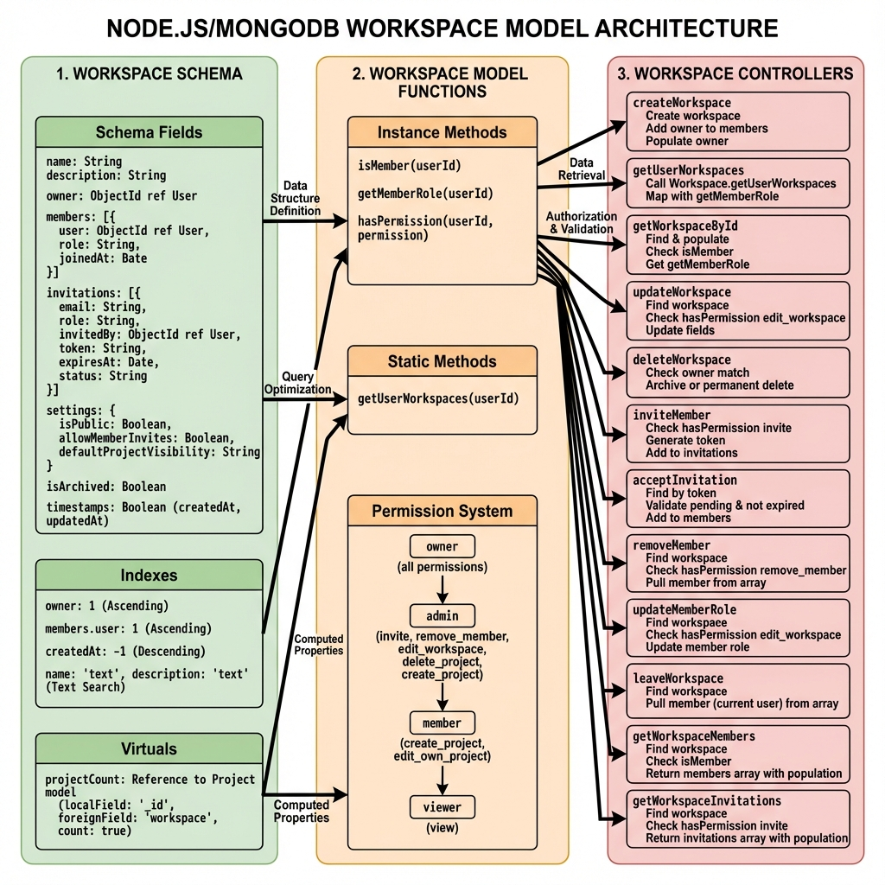
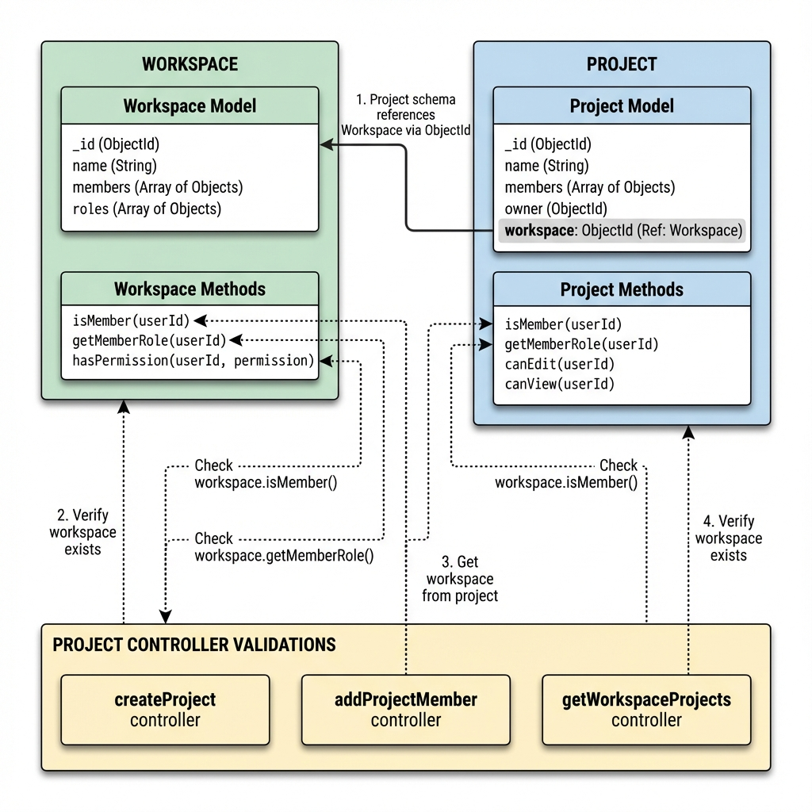
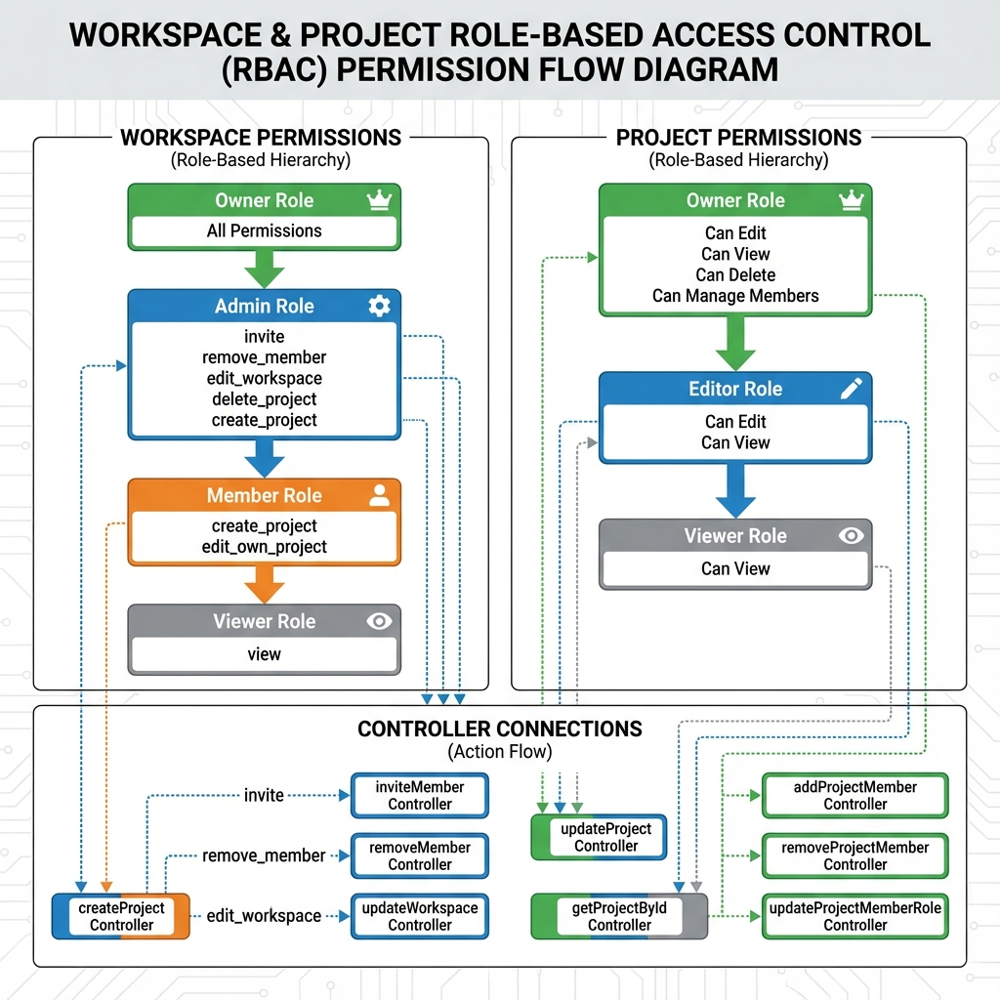
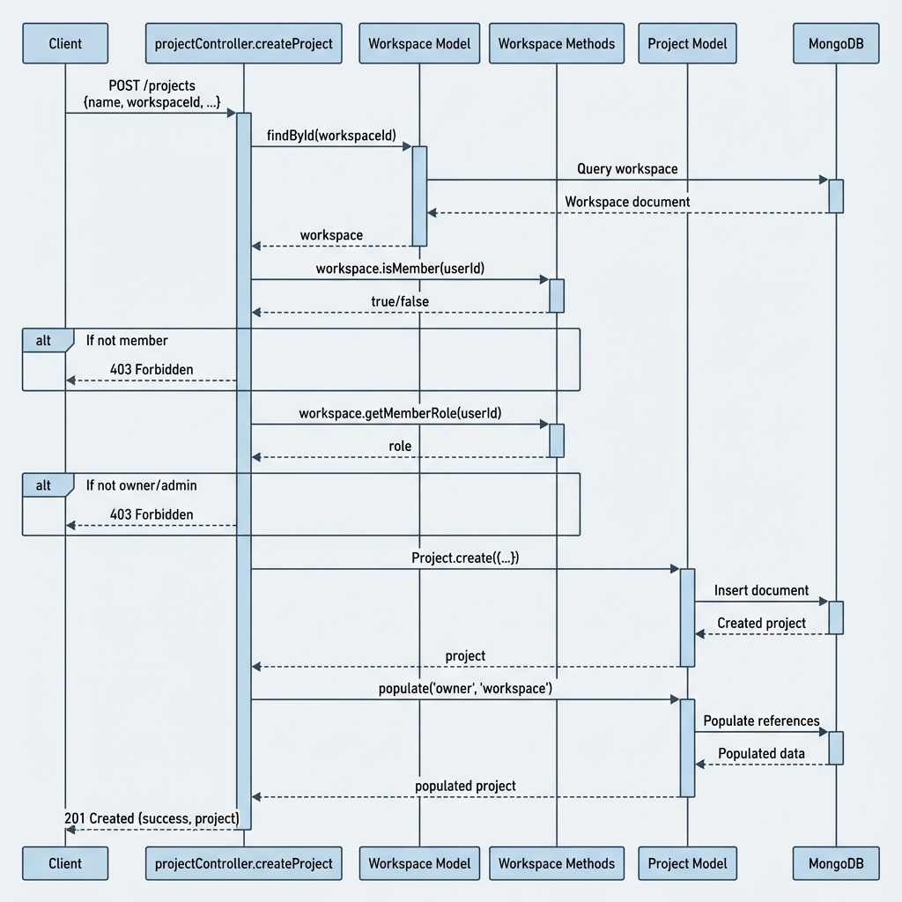
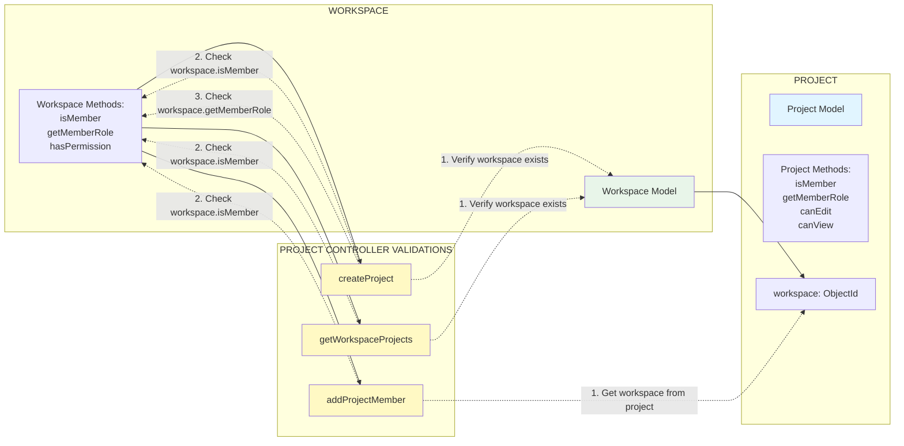
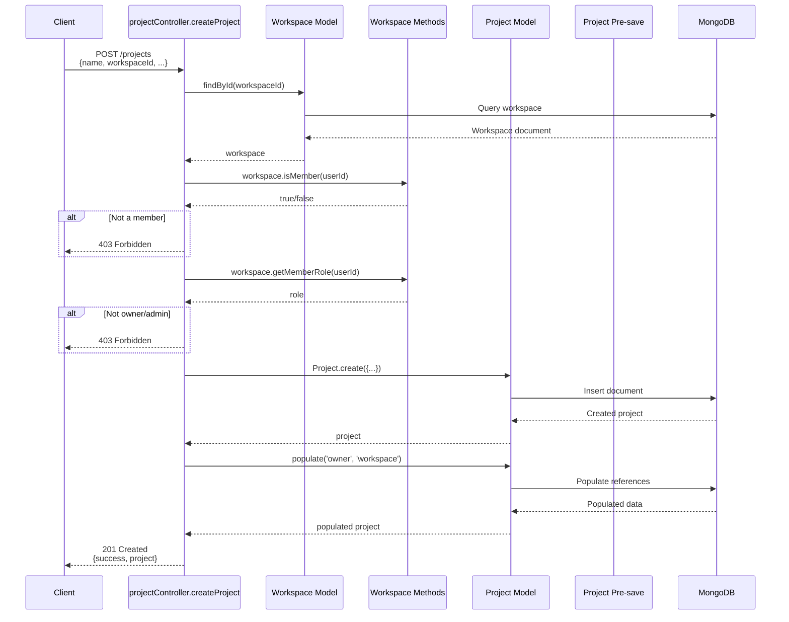
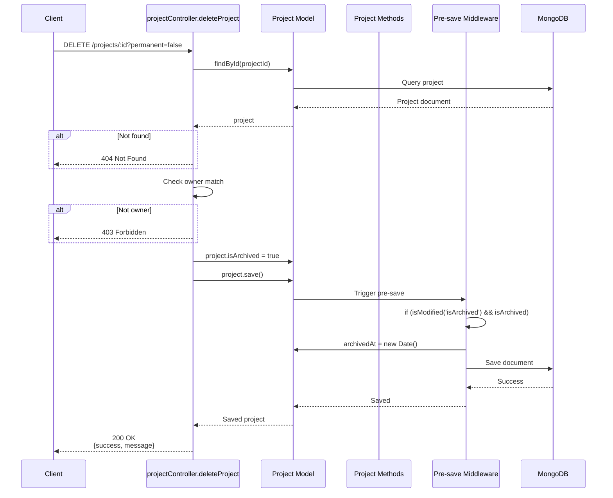

# Models & Controllers Architecture Flowchart

This document provides a detailed flowchart showing the connections between model schemas, model functions (methods, statics, pre-save middleware), and controller endpoints for Project and Workspace entities.

> [!TIP]
> **Click on any image below to zoom in and explore details!** Use the carousel arrows to navigate between different diagrams.

---

## 📊 Visual Flowcharts (Zoomable)

````carousel

<!-- slide -->

<!-- slide -->

<!-- slide -->

<!-- slide -->

````

---

## Project Entity Flow

```mermaid
graph TB
    subgraph "PROJECT SCHEMA"
        PS[Project Schema]
        PS --> PS_FIELDS[Schema Fields]
        PS_FIELDS --> PS_F1[name, description]
        PS_FIELDS --> PS_F2[workspace: ObjectId ref Workspace]
        PS_FIELDS --> PS_F3[owner: ObjectId ref User]
        PS_FIELDS --> PS_F4[members: Array<br/>user, role, addedAt]
        PS_FIELDS --> PS_F5[status, priority]
        PS_FIELDS --> PS_F6[startDate, dueDate, progress]
        PS_FIELDS --> PS_F7[tags, color, visibility]
        PS_FIELDS --> PS_F8[settings: Object<br/>allowComments, notifyOnTaskUpdate<br/>enableRealTimeEditing]
        PS_FIELDS --> PS_F9[isArchived, archivedAt]
        PS_FIELDS --> PS_F10[timestamps: createdAt, updatedAt]
        
        PS --> PS_IDX[Indexes]
        PS_IDX --> PI1[workspace + createdAt]
        PS_IDX --> PI2[owner]
        PS_IDX --> PI3[members.user]
        PS_IDX --> PI4[status]
        PS_IDX --> PI5[priority]
        PS_IDX --> PI6[text: name, description]
        PS_IDX --> PI7[tags]
        
        PS --> PS_VIRT[Virtuals]
        PS_VIRT --> PV1[taskCount: ref Task]
    end
    
    subgraph "PROJECT MODEL FUNCTIONS"
        PMF[Project Model Functions]
        
        PMF --> PM_METHODS[Instance Methods]
        PM_METHODS --> PM1[isMember userId]
        PM_METHODS --> PM2[getMemberRole userId]
        PM_METHODS --> PM3[canEdit userId]
        PM_METHODS --> PM4[canView userId]
        PM_METHODS --> PM5[updateProgress]
        
        PMF --> PM_STATICS[Static Methods]
        PM_STATICS --> PMS1[getWorkspaceProjects<br/>workspaceId, userId, filters]
        PM_STATICS --> PMS2[getUserProjects<br/>userId]
        
        PMF --> PM_PRE[Pre-save Middleware]
        PM_PRE --> PP1[Auto-set archivedAt<br/>when isArchived = true]
    end
    
    subgraph "PROJECT CONTROLLERS"
        PC[Project Controllers]
        
        PC --> PC_CREATE[createProject]
        PC_CREATE --> PC_CREATE_FLOW[1. Validate workspace exists<br/>2. Check workspace.isMember<br/>3. Check workspace.getMemberRole<br/>4. Create project<br/>5. Populate owner & workspace]
        
        PC --> PC_GET_USER[getUserProjects]
        PC_GET_USER --> PC_GET_USER_FLOW[1. Call Project.getUserProjects<br/>2. Map with getMemberRole & canEdit]
        
        PC --> PC_GET_BY_ID[getProjectById]
        PC_GET_BY_ID --> PC_GET_BY_ID_FLOW[1. Find & populate<br/>2. Check canView<br/>3. Get getMemberRole & canEdit]
        
        PC --> PC_UPDATE[updateProject]
        PC_UPDATE --> PC_UPDATE_FLOW[1. Find project<br/>2. Check canEdit<br/>3. Update fields<br/>4. Save triggers pre-save]
        
        PC --> PC_DELETE[deleteProject]
        PC_DELETE --> PC_DELETE_FLOW[1. Check owner match<br/>2. Archive or permanent delete<br/>3. Pre-save sets archivedAt]
        
        PC --> PC_ADD_MEMBER[addProjectMember]
        PC_ADD_MEMBER --> PC_ADD_MEMBER_FLOW[1. Check owner<br/>2. Check workspace.isMember<br/>3. Check project.isMember<br/>4. Add to members array]
        
        PC --> PC_REMOVE_MEMBER[removeProjectMember]
        PC_REMOVE_MEMBER --> PC_REMOVE_MEMBER_FLOW[1. Check owner<br/>2. Validate not owner<br/>3. Remove from members]
        
        PC --> PC_UPDATE_ROLE[updateProjectMemberRole]
        PC_UPDATE_ROLE --> PC_UPDATE_ROLE_FLOW[1. Check owner<br/>2. Find member<br/>3. Update role]
        
        PC --> PC_LEAVE[leaveProject]
        PC_LEAVE --> PC_LEAVE_FLOW[1. Check not owner<br/>2. Remove self from members]
        
        PC --> PC_GET_MEMBERS[getProjectMembers]
        PC_GET_MEMBERS --> PC_GET_MEMBERS_FLOW[1. Check canView<br/>2. Return owner + members]
        
        PC --> PC_GET_WS_PROJECTS[getWorkspaceProjects]
        PC_GET_WS_PROJECTS --> PC_GET_WS_PROJECTS_FLOW[1. Check workspace.isMember<br/>2. Call Project.getWorkspaceProjects<br/>3. Map with getMemberRole]
    end
    
    PS_FIELDS --> PM1
    PS_FIELDS --> PM2
    PS_FIELDS --> PM3
    PS_FIELDS --> PM4
    PS_FIELDS --> PP1
    
    PMS1 --> PC_GET_WS_PROJECTS_FLOW
    PMS2 --> PC_GET_USER_FLOW
    PM1 --> PC_CREATE_FLOW
    PM1 --> PC_ADD_MEMBER_FLOW
    PM2 --> PC_GET_USER_FLOW
    PM2 --> PC_GET_BY_ID_FLOW
    PM2 --> PC_GET_WS_PROJECTS_FLOW
    PM3 --> PC_GET_USER_FLOW
    PM3 --> PC_GET_BY_ID_FLOW
    PM3 --> PC_UPDATE_FLOW
    PM4 --> PC_GET_BY_ID_FLOW
    PM4 --> PC_GET_MEMBERS_FLOW
    PP1 --> PC_DELETE_FLOW
    PP1 --> PC_UPDATE_FLOW
    
    style PS fill:#e1f5ff
    style PMF fill:#fff4e6
    style PC fill:#f3e5f5
```



---

## Workspace Entity Flow

```mermaid
graph TB
    subgraph "WORKSPACE SCHEMA"
        WS[Workspace Schema]
        WS --> WS_FIELDS[Schema Fields]
        WS_FIELDS --> WS_F1[name, description]
        WS_FIELDS --> WS_F2[owner: ObjectId ref User]
        WS_FIELDS --> WS_F3[members: Array<br/>user, role, joinedAt]
        WS_FIELDS --> WS_F4[invitations: Array<br/>email, role, invitedBy<br/>token, expiresAt, status]
        WS_FIELDS --> WS_F5[settings: Object<br/>isPublic, allowMemberInvites<br/>defaultProjectVisibility]
        WS_FIELDS --> WS_F6[isArchived]
        WS_FIELDS --> WS_F7[timestamps: createdAt, updatedAt]
        
        WS --> WS_IDX[Indexes]
        WS_IDX --> WI1[owner]
        WS_IDX --> WI2[members.user]
        WS_IDX --> WI3[createdAt]
        WS_IDX --> WI4[text: name, description]
        
        WS --> WS_VIRT[Virtuals]
        WS_VIRT --> WV1[projectCount: ref Project]
    end
    
    subgraph "WORKSPACE MODEL FUNCTIONS"
        WMF[Workspace Model Functions]
        
        WMF --> WM_METHODS[Instance Methods]
        WM_METHODS --> WM1[isMember userId]
        WM_METHODS --> WM2[getMemberRole userId]
        WM_METHODS --> WM3[hasPermission userId, permission]
        
        WMF --> WM_STATICS[Static Methods]
        WM_STATICS --> WMS1[getUserWorkspaces<br/>userId]
        
        WMF --> WM_PERMS[Permission System]
        WM_PERMS --> WP1[owner: all]
        WM_PERMS --> WP2[admin: invite, remove_member<br/>edit_workspace, delete_project<br/>create_project]
        WM_PERMS --> WP3[member: create_project<br/>edit_own_project]
        WM_PERMS --> WP4[viewer: view]
    end
    
    subgraph "WORKSPACE CONTROLLERS"
        WC[Workspace Controllers]
        
        WC --> WC_CREATE[createWorkspace]
        WC_CREATE --> WC_CREATE_FLOW[1. Create workspace<br/>2. Add owner to members<br/>3. Populate owner]
        
        WC --> WC_GET_USER[getUserWorkspaces]
        WC_GET_USER --> WC_GET_USER_FLOW[1. Call Workspace.getUserWorkspaces<br/>2. Map with getMemberRole]
        
        WC --> WC_GET_BY_ID[getWorkspaceById]
        WC_GET_BY_ID --> WC_GET_BY_ID_FLOW[1. Find & populate<br/>2. Check isMember<br/>3. Get getMemberRole]
        
        WC --> WC_UPDATE[updateWorkspace]
        WC_UPDATE --> WC_UPDATE_FLOW[1. Find workspace<br/>2. Check hasPermission edit_workspace<br/>3. Update fields<br/>4. Save]
        
        WC --> WC_DELETE[deleteWorkspace]
        WC_DELETE --> WC_DELETE_FLOW[1. Check owner match<br/>2. Archive or permanent delete]
        
        WC --> WC_INVITE[inviteMember]
        WC_INVITE --> WC_INVITE_FLOW[1. Check hasPermission invite<br/>2. Validate not member<br/>3. Generate token<br/>4. Add to invitations]
        
        WC --> WC_ACCEPT[acceptInvitation]
        WC_ACCEPT --> WC_ACCEPT_FLOW[1. Find by token<br/>2. Validate pending & not expired<br/>3. Check not isMember<br/>4. Add to members<br/>5. Update invitation status]
        
        WC --> WC_REMOVE[removeMember]
        WC_REMOVE --> WC_REMOVE_FLOW[1. Check hasPermission remove_member<br/>2. Validate not owner<br/>3. Remove from members]
        
        WC --> WC_UPDATE_ROLE[updateMemberRole]
        WC_UPDATE_ROLE --> WC_UPDATE_ROLE_FLOW[1. Check owner<br/>2. Find member<br/>3. Update role]
        
        WC --> WC_LEAVE[leaveWorkspace]
        WC_LEAVE --> WC_LEAVE_FLOW[1. Check not owner<br/>2. Remove self from members]
        
        WC --> WC_GET_MEMBERS[getWorkspaceMembers]
        WC_GET_MEMBERS --> WC_GET_MEMBERS_FLOW[1. Check isMember<br/>2. Return owner + members]
        
        WC --> WC_GET_INVITES[getWorkspaceInvitations]
        WC_GET_INVITES --> WC_GET_INVITES_FLOW[1. Check hasPermission invite<br/>2. Filter pending & valid invitations]
    end
    
    WS_FIELDS --> WM1
    WS_FIELDS --> WM2
    WS_FIELDS --> WM3
    
    WMS1 --> WC_GET_USER_FLOW
    WM1 --> WC_GET_BY_ID_FLOW
    WM1 --> WC_GET_MEMBERS_FLOW
    WM1 --> WC_ACCEPT_FLOW
    WM2 --> WC_GET_USER_FLOW
    WM2 --> WC_GET_BY_ID_FLOW
    WM3 --> WC_UPDATE_FLOW
    WM3 --> WC_INVITE_FLOW
    WM3 --> WC_REMOVE_FLOW
    WM3 --> WC_GET_INVITES_FLOW
    
    style WS fill:#e8f5e9
    style WMF fill:#fff3e0
    style WC fill:#fce4ec
```



---

## Cross-Model Interactions



---

## Detailed Method Usage Matrix

### Project Model Methods Usage

| Method | Used In Controllers | Purpose |
|--------|---------------------|---------|
| `isMember(userId)` | `createProject`, `addProjectMember` | Check if user is project member |
| `getMemberRole(userId)` | `getUserProjects`, `getProjectById`, `getWorkspaceProjects` | Get user's role in project |
| `canEdit(userId)` | `getUserProjects`, `getProjectById`, `updateProject` | Check edit permission |
| `canView(userId)` | `getProjectById`, `getProjectMembers` | Check view permission |
| `updateProgress()` | Not currently used | Future task progress calculation |

### Project Static Methods Usage

| Static Method | Used In Controllers | Purpose |
|---------------|---------------------|---------|
| `getWorkspaceProjects(workspaceId, userId, filters)` | `getWorkspaceProjects` | Fetch filtered workspace projects |
| `getUserProjects(userId)` | `getUserProjects` | Fetch all user's projects |

### Project Pre-save Middleware

| Trigger | Action | Used In Controllers |
|---------|--------|---------------------|
| `isArchived` modified to `true` | Auto-set `archivedAt = new Date()` | `deleteProject`, `updateProject` |

---

### Workspace Model Methods Usage

| Method | Used In Controllers | Purpose |
|--------|---------------------|---------|
| `isMember(userId)` | `getWorkspaceById`, `getWorkspaceMembers`, `acceptInvitation`, plus Project controllers | Check if user is workspace member |
| `getMemberRole(userId)` | `getUserWorkspaces`, `getWorkspaceById` | Get user's role in workspace |
| `hasPermission(userId, permission)` | `updateWorkspace`, `inviteMember`, `removeMember`, `getWorkspaceInvitations` | Check specific permission |

### Workspace Static Methods Usage

| Static Method | Used In Controllers | Purpose |
|---------------|---------------------|---------|
| `getUserWorkspaces(userId)` | `getUserWorkspaces` | Fetch all user's workspaces |

---

## Permission Flow

```mermaid
graph TB
    subgraph "Workspace Permissions"
        OWNER[Owner Role]
        ADMIN[Admin Role]
        MEMBER[Member Role]
        VIEWER[Viewer Role]
        
        OWNER --> PERM_ALL[All Permissions]
        
        ADMIN --> PERM_INVITE[invite]
        ADMIN --> PERM_REMOVE[remove_member]
        ADMIN --> PERM_EDIT_WS[edit_workspace]
        ADMIN --> PERM_DEL_PROJ[delete_project]
        ADMIN --> PERM_CREATE_PROJ[create_project]
        
        MEMBER --> PERM_CREATE_PROJ
        MEMBER --> PERM_EDIT_OWN[edit_own_project]
        
        VIEWER --> PERM_VIEW[view]
    end
    
    subgraph "Project Permissions"
        P_OWNER[Owner Role]
        P_EDITOR[Editor Role]
        P_VIEWER[Viewer Role]
        
        P_OWNER --> P_CAN_EDIT[Can Edit]
        P_OWNER --> P_CAN_VIEW[Can View]
        P_OWNER --> P_CAN_DELETE[Can Delete]
        P_OWNER --> P_CAN_MANAGE[Can Manage Members]
        
        P_EDITOR --> P_CAN_EDIT
        P_EDITOR --> P_CAN_VIEW
        
        P_VIEWER --> P_CAN_VIEW
    end
    
    PERM_CREATE_PROJ -.->|Required for| CREATE_PROJECT[createProject Controller]
    PERM_INVITE -.->|Required for| INVITE[inviteMember Controller]
    PERM_REMOVE -.->|Required for| REMOVE[removeMember Controller]
    PERM_EDIT_WS -.->|Required for| UPDATE_WS[updateWorkspace Controller]
    
    P_CAN_EDIT -.->|Required for| UPDATE_PROJECT[updateProject Controller]
    P_CAN_VIEW -.->|Required for| VIEW_PROJECT[getProjectById Controller]
    P_CAN_MANAGE -.->|Required for| MANAGE_MEMBERS[addProjectMember<br/>removeProjectMember<br/>updateProjectMemberRole]
    
    style OWNER fill:#4caf50
    style ADMIN fill:#2196f3
    style MEMBER fill:#ff9800
    style VIEWER fill:#9e9e9e
    style P_OWNER fill:#4caf50
    style P_EDITOR fill:#2196f3
    style P_VIEWER fill:#9e9e9e
```



---

## Complete Data Flow Example: Creating a Project



---

## Complete Data Flow Example: Archiving a Project



---

## Summary

### Project Model
- **Schema**: 9 main field groups, 7 indexes, 1 virtual
- **Methods**: 5 instance methods (isMember, getMemberRole, canEdit, canView, updateProgress)
- **Statics**: 2 static methods (getWorkspaceProjects, getUserProjects)
- **Middleware**: 1 pre-save hook (auto-set archivedAt)
- **Controllers**: 11 controller functions utilizing these features

### Workspace Model
- **Schema**: 7 main field groups, 4 indexes, 1 virtual
- **Methods**: 3 instance methods (isMember, getMemberRole, hasPermission)
- **Statics**: 1 static method (getUserWorkspaces)
- **Middleware**: None
- **Controllers**: 12 controller functions utilizing these features

### Key Integration Points
1. **Project controllers depend on Workspace methods** for permission checking
2. **Pre-save middleware** automatically handles archival timestamps
3. **Static methods** provide optimized queries for common use cases
4. **Instance methods** encapsulate business logic for reusability across controllers
5. **Permission system** in Workspace model controls access at both workspace and project levels
